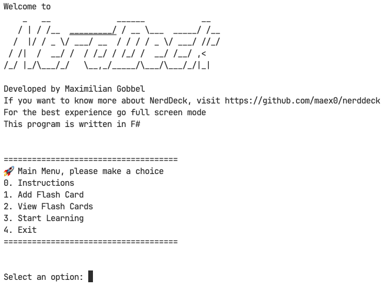
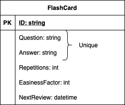

# NerdDeck


Welcome to _NerdDeck_, a project initiated during the first semester of my Master's program at [TH Rosenheim](https://www.th-rosenheim.de) in the course **Concepts of Programming Languages**. In this project, I will be comparing two programming languages, [Go](https://go.dev) and [F#](https://dotnet.microsoft.com/languages/fsharp), within the context of functional programming.

## Project Overview

This repository is dedicated to exploring the paradigms of functional programming in the context of two distinct programming languages: Go and F#.



## Table of Contents

- [Introduction](#nerddeck)
- [Project Overview](#project-overview)
- [Paper](#paper)
- [Getting Started](#getting-started)
  - [Go](#go)
  - [F#](#fsharp)
- [Database](#database)
  - [Database Schema](#database-schema)
- [Model](#Model)
- [Contributing](#contributing)
- [License](#license)

## Paper

I wrote a paper for this project, it contains an introduction for functional programming, for Go and F# and also for the coding project _NerdDeck_. This paper was written in LaTeX and can be found here [here](./docs/).

## Getting Started

This section is about how you can execute the code by yourself. Note that _NerdDeck_ is only a command line program!

### Go

- Verify that you have installed everything which is necessary Go on your system (info can be found here)
- Clone the repository:
  `git clone https://github.com/maex0/nerddeck.git`
- Navigate to the project directory: `cd nerddeck`
- Navigate to the go project directory: `cd go`
- Execute and verify there are no build errors
- Execute and enjoy _NerdDeck_

### F# <a id="fsharp"></a>

- Verify that you have installed everything which is necessary F# on your system. [.NET 7](https://dotnet.microsoft.com/en-us/download/dotnet/7.0) is used.
- Clone the repository:
  `git clone https://github.com/maex0/nerddeck.git`
- Navigate to the go project directory: `cd fsharp/NerdDeckFSharp`
- Execute `dotnet build` and verify there are no build errors
- Execute `dotnet run` and enjoy _NerdDeck_

## Database

**Disclaimer:** For the purpose of this project, a single json file is used as a simple and lightweight database to store flashcards. While this approach is suitable for educational and illustrative purposes, it may not be suitable for production usage due to limitations in scalability and concurrent access.

In a production environment, a more robust database solution should be considered, such as a relational database (e.g., PostgreSQL, MySQL) or a NoSQL database (e.g., MongoDB). The choice of the database will depend on the specific requirements of the application.

### Database Schema

The flashcard data is stored in a JSON file with the following structure:

```json
[
  {
    "ID": "37268335dd6931045bdcdf926",
    "Question": "What algebraic data types does F# use?",
    "Answer": "Record types and discriminated unions",
    "Repetitions": 1,
    "EasinessFactor": 1.3,
    "NextReview": "2023-12-18T18:17:22.438077+01:00"
  }
]
```

## Model

ID is the primary key, generated from question and answer.



## Contributing

Contributions are welcome! If you have insights, suggestions, or additional examples to contribute, feel free to contact me.

## License

This project is open-source and available under the [MIT License](LICENSE). See the [License](LICENSE) file for more details.
